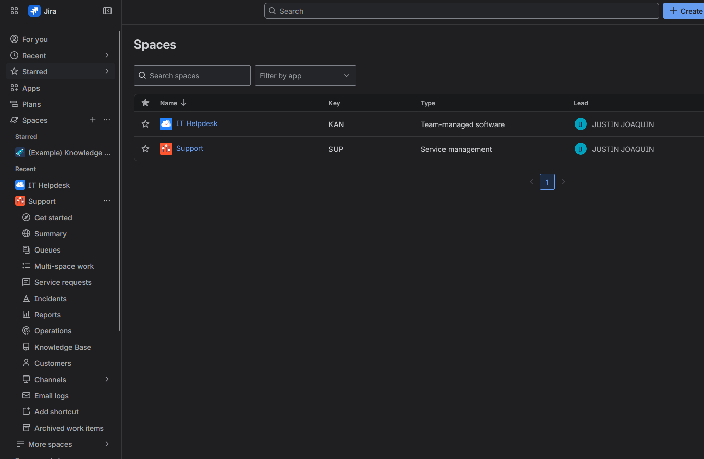
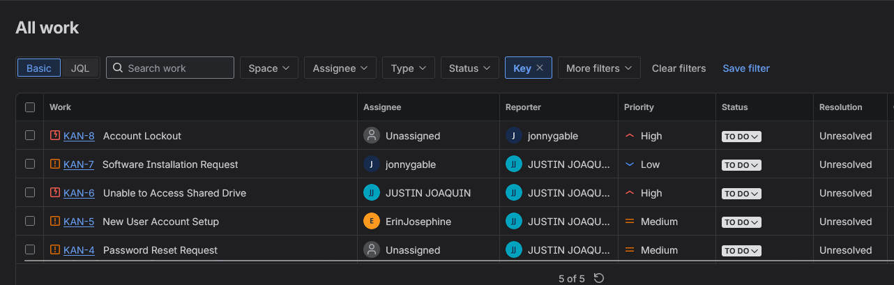
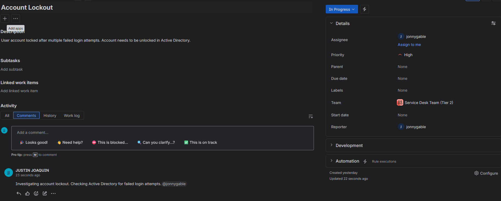
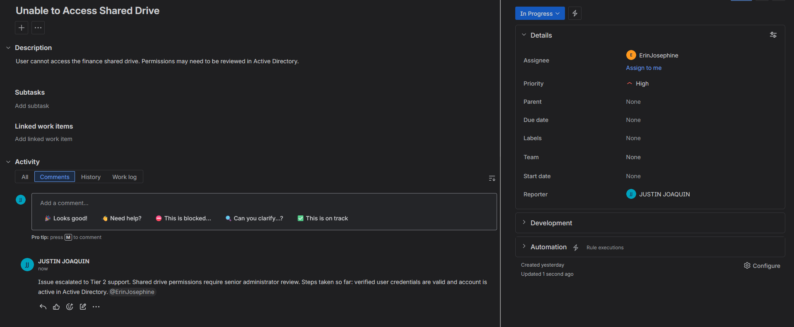
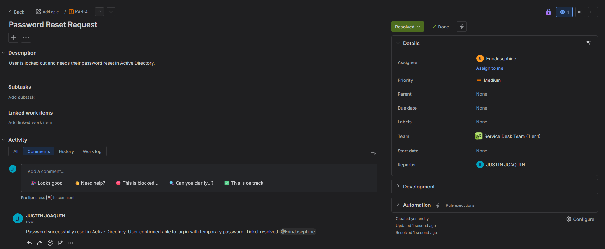
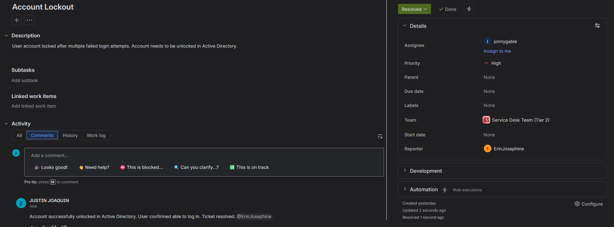

# Jira Service Management Lab

Jira Service Management lab simulating a real help desk environment. Covers ticket creation, triage, assignment, escalation, priority management, and resolution workflows using Jira Service Management.

---

## Table of Contents

1. [Project Overview](#project-overview)
2. [Creating a Project](#creating-a-project)
3. [Creating Tickets](#creating-tickets)
4. [Ticket Triage and Priority](#ticket-triage-and-priority)
5. [Assigning Tickets](#assigning-tickets)
6. [Escalating Tickets](#escalating-tickets)
7. [Resolving Tickets](#resolving-tickets)
8. [Queues and Filters](#queues-and-filters)

---

## Software Used

- Jira Service Management
- Microsoft Azure
- Active Directory Domain Services (AD DS)
- Microsoft Entra ID

---

## Environments Used

- Jira Service Management (Cloud)
- Windows Server 2022
- Azure Virtual Machine

---

## Project Overview

This lab simulates a real IT help desk environment using Jira Service Management. Tickets were created to reflect common help desk requests and incidents, then triaged, assigned, escalated, and resolved following standard IT support workflows. The tickets in this lab reference tasks performed in the Active Directory and Entra ID labs to connect the projects together.

---

## Creating a Project

A Jira Service Management project was created using the IT Service Desk template to simulate a real help desk ticketing environment.

- An IT Service Management project was created in Jira to serve as the central hub for managing and tracking help desk tickets throughout this lab.

---

## Creating Tickets

Five tickets were created to simulate common help desk requests and incidents. Each ticket includes a summary, type, priority, and description reflecting real world IT support scenarios.

- Five tickets were created covering common help desk scenarios including password resets, account lockouts, access issues, new user setup, and software installation requests.

---

## Ticket Triage and Priority

Triage involves reviewing incoming tickets and setting the correct priority based on business impact. High priority tickets like account lockouts require immediate attention as they directly prevent users from working.

- The Account Lockout ticket was triaged, set to High priority, moved to In Progress, and a comment was added documenting the initial investigation steps.

---

## Assigning Tickets

Tickets are assigned to the appropriate technician based on the type of request. Assigning tickets ensures accountability and allows managers to track workload across the team.

- The Password Reset ticket was assigned and a comment was added documenting the resolution steps taken in Active Directory.

---

## Escalating Tickets

Some tickets require escalation to a higher tier of support when the issue is beyond the scope of Tier 1. Proper escalation documentation ensures the next technician has full context to continue working the ticket.

- The shared drive access ticket was escalated to Tier 2 support with a comment documenting the reason for escalation and steps already taken.

---

## Resolving Tickets

Tickets are resolved once the issue has been fixed and confirmed by the user. A resolution comment is added documenting exactly what was done before closing the ticket.

- The Password Reset ticket was resolved after confirming the user was able to log in successfully with the temporary password.

- The Account Lockout ticket was resolved after unlocking the account in Active Directory and confirming the user was able to log in.

---

## Queues and Filters

Queues allow help desk technicians to view and manage tickets based on specific criteria such as priority or assignment. This helps technicians prioritize their work and ensures no tickets are missed.

- The High Priority queue was used to identify and focus on the most critical open tickets.

- The Assigned to Me queue was used to view all tickets currently assigned and track their resolution status.

---

## Challenges and Takeaways

**Challenges:**

**Takeaways:**
